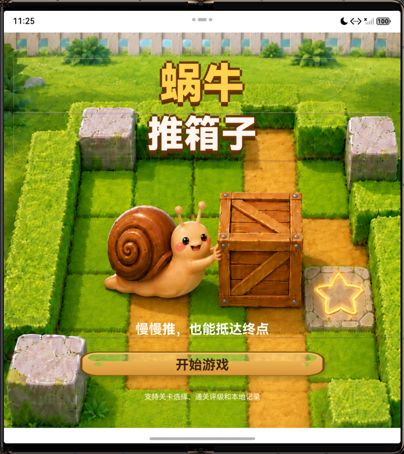
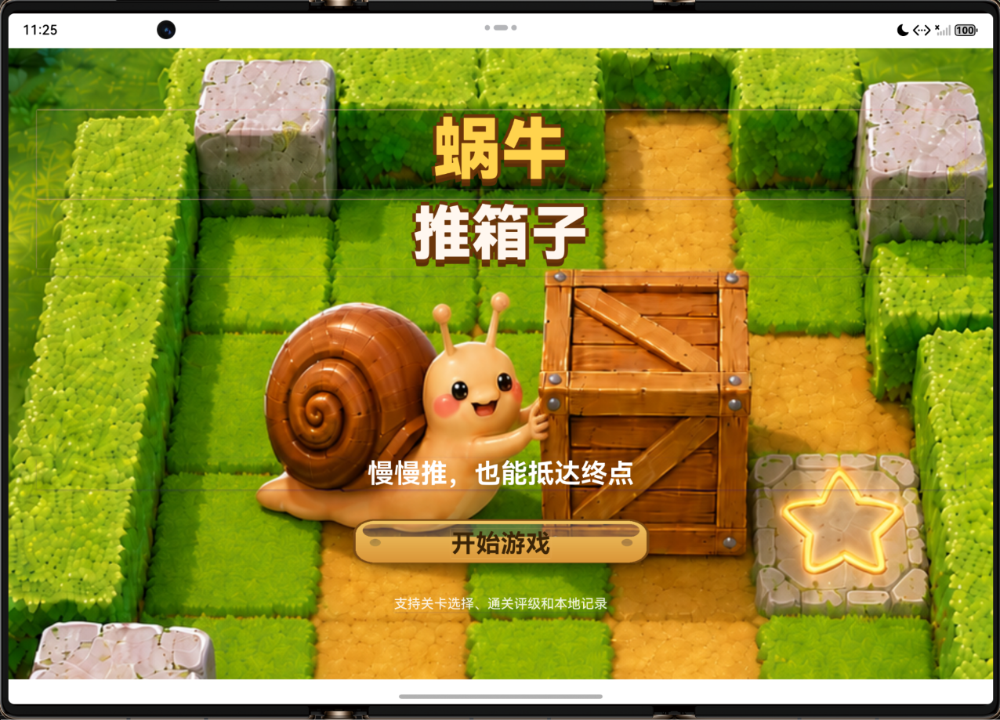
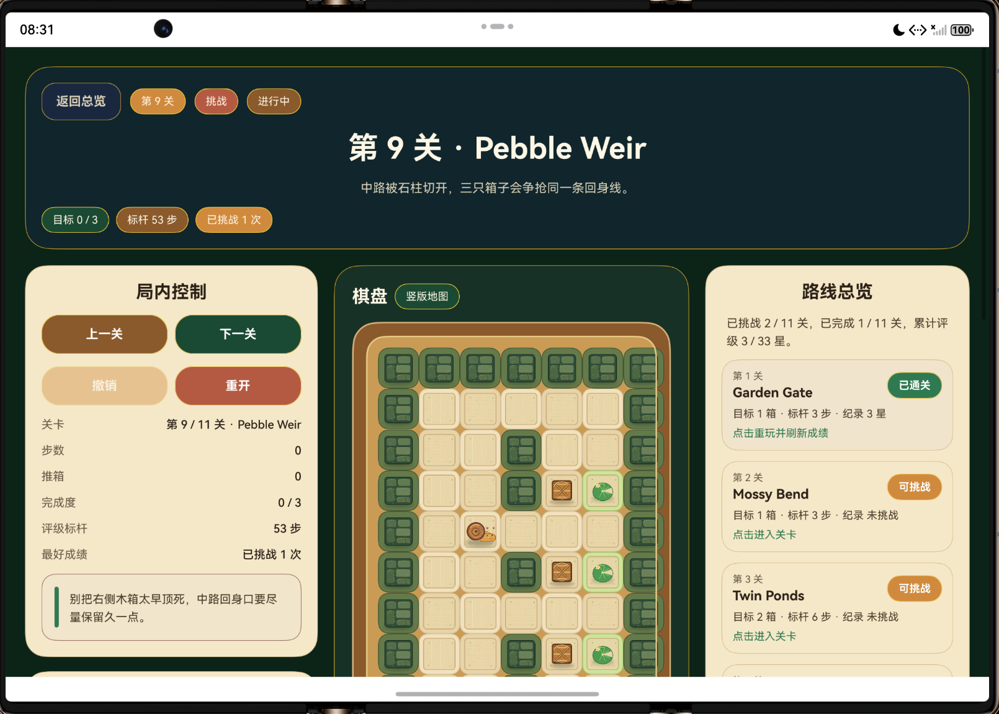
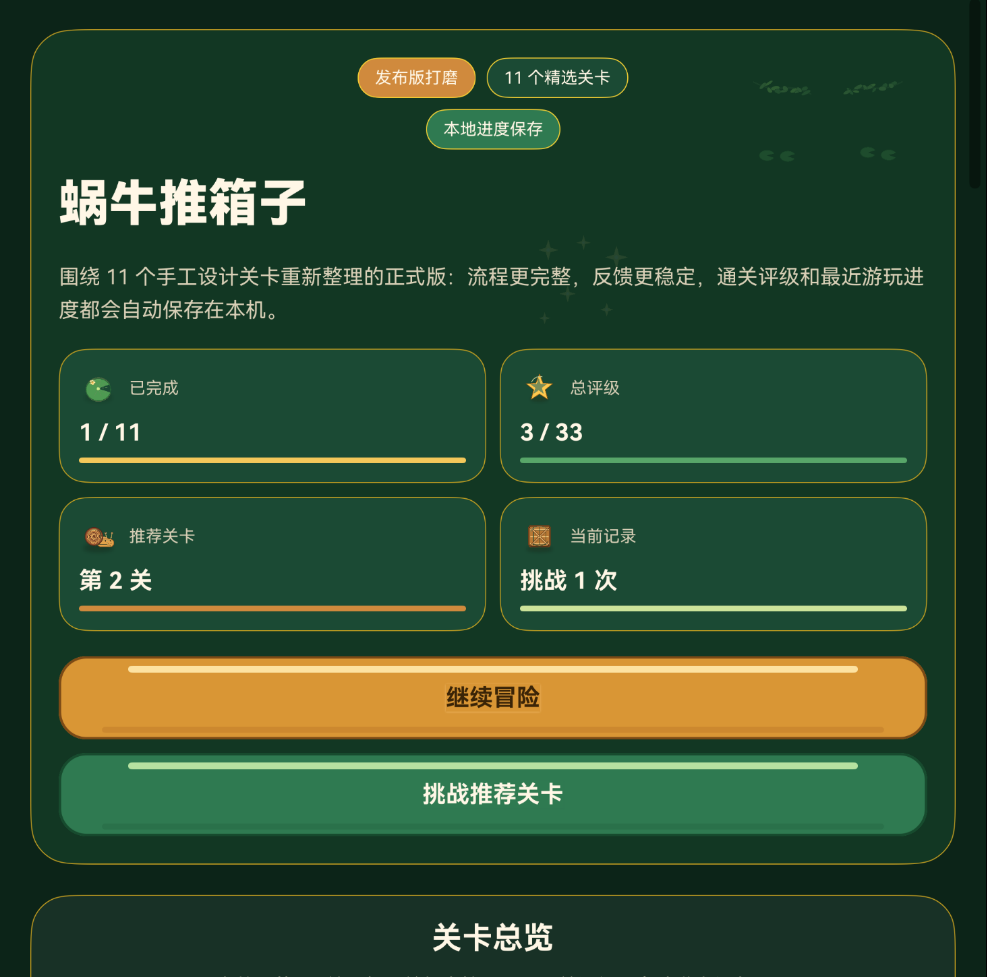
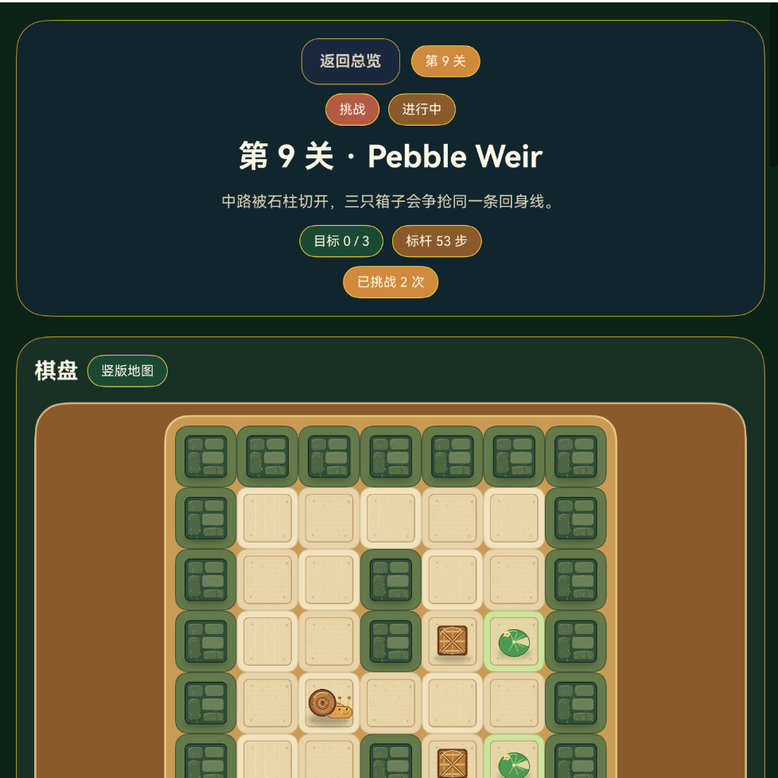
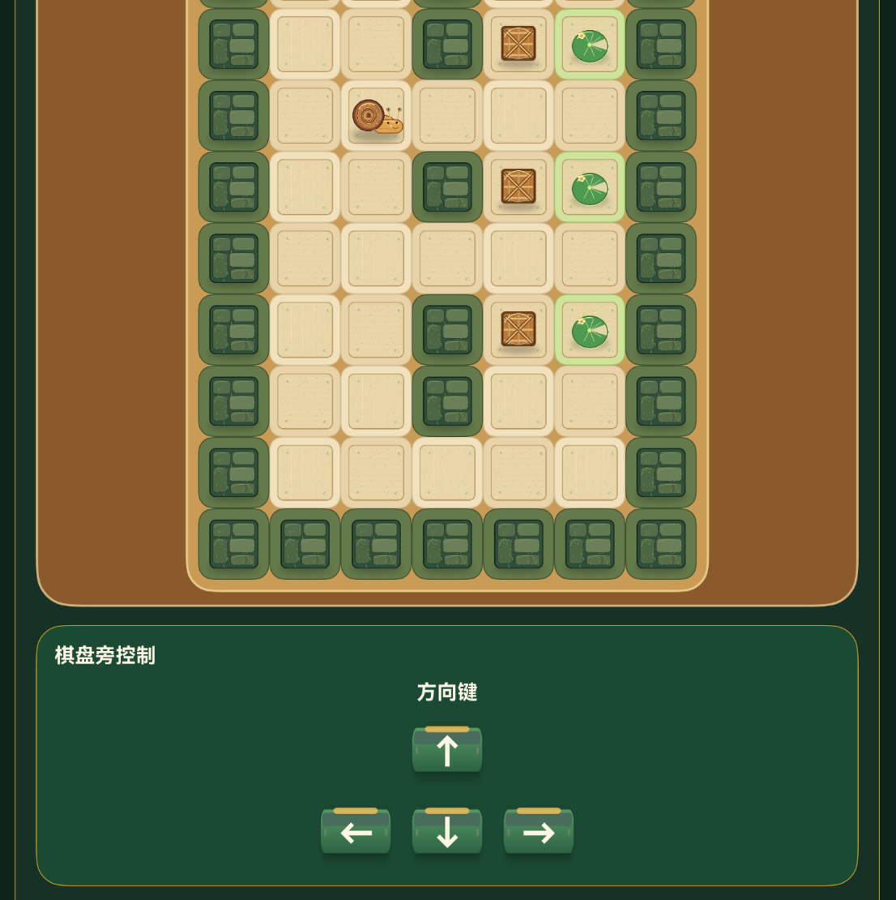

# 蜗牛推箱子

## 作者：付喆

蜗牛推箱子是一款基于 HarmonyOS / ArkTS 开发的关卡制 Sokoban 益智小游戏。玩家控制蜗牛在森林棋盘中移动，将所有木箱推到荷叶目标点，完成关卡挑战并获得星级评价。


游戏包含开始页、关卡总览、局内控制、路线总览、通关动画、本地挑战记录、背景音乐、开始页音乐和通关音效，形成完整的移动端小游戏流程。


## 游戏截图


### 开始页面


#### 单屏大小开始页面


#### 双屏大小开始页面





#### 三屏大小开始页面





### 关卡总览


### 棋盘与局内控制


### 路线总览


### 通关反馈


### 游戏内的自适应布局


#### 三屏-关卡总览


#### 三屏-棋盘与局内控制





#### 双屏-关卡总览





#### 双屏-棋盘与局内控制








## 核心功能


- 自适应布局，元素可以适应手机、平板、三折叠等屏幕变化

- 支持一次开发多端部署，`entry` 模块已声明 `phone`、`tablet`、`2in1` 设备类型。

- 支持自由流转，跨设备接续时会恢复当前页面、关卡、步数、推箱次数和棋盘状态。

- 11 个关卡，难度从入门到挑战逐步提升。

- 所有关卡初始可直接选择，无需解锁。

- 支持屏幕方向键、键盘方向键和 `W`、`A`、`S`、`D` 操作。

- 支持撤销、重开、上一关、下一关和返回总览。

- 游戏缓存会自动保存最近游玩关卡、挑战次数、最佳步数、最佳推箱次数和最高星级。

- 通关后展示完成面板、星级评价和下一关入口。

- 播放通关音效时暂停背景音乐，音效结束后恢复背景音乐。

- 长地图支持竖版关卡布局，避免棋盘超出可视范围。

- 棋盘元素使用蜗牛、木箱、荷叶、森林地面和苔藓墙体素材渲染。


## 玩法规则


玩家每次移动一格。当前方是木箱时，如果木箱后方是可行走地块，蜗牛会推动木箱前进一格；如果后方是墙体、空洞或其他木箱，本次移动会被阻止。


通关条件为所有木箱都位于荷叶目标点上。游戏根据关卡标杆步数计算星级，并保存每一关的最佳成绩。


## 操作方式


| 操作 | 说明 |

| --- | --- |

| 屏幕方向键 | 点击 `↑`、`←`、`↓`、`→` 移动蜗牛 |

| 键盘方向键 | 使用物理键盘方向键移动 |

| WASD | 使用 `W`、`A`、`S`、`D` 移动 |

| 撤销 | 回退上一步 |

| 重开 | 重置当前关卡 |

| 上一关 / 下一关 | 切换关卡 |

| 返回总览 | 回到首页选择关卡 |


## 关卡列表


| 关卡 | 名称 | 难度 | 标杆步数 | 设计重点 |

| --- | --- | --- | --- | --- |

| 1 | Garden Gate | 入门 | 3 | 学习基础推箱和绕位 |

| 2 | Mossy Bend | 入门 | 3 | 观察墙体对站位的影响 |

| 3 | Twin Ponds | 标准 | 6 | 同时处理两个木箱 |

| 4 | Fern Maze | 标准 | 17 | 判断中段墙体切分后的路线顺序 |

| 5 | Moonlit Depot | 挑战 | 45 | 开阔空间中的连续调整 |

| 6 | Reed Lattice | 挑战 | 47 | 三箱规划和竖版地图 |

| 7 | Lily Vault | 挑战 | 51 | 避免中央箱位堵住两侧通道 |

| 8 | Cattail Switchyard | 挑战 | 51 | 处理上下动线互相干扰 |

| 9 | Pebble Weir | 挑战 | 53 | 在中路限制下完成回身 |

| 10 | Drift Gallery | 挑战 | 56 | 利用门洞完成换位 |

| 11 | Harbor of Shells | 挑战 | 57 | 综合考验内外墙体和回旋空间 |


## 技术实现


### 页面与流程


`entry/src/main/ets/pages/Index.ets` 负责主要页面和运行流程，包括开始页、首页、游玩页、棋盘渲染、局内控制、路线总览、通关弹层、音频播放和存档读写。


### 自适应布局


主页面使用 ArkUI 声明式组件实现响应式排版：外层通过 `Scroll` 承载整页内容，内部使用 `Column` 组织纵向模块，使用 `Row` 在宽屏下拆分局内控制区、棋盘区和关卡路线区，使用 `Stack` 叠放开始页背景、装饰图和通关弹层，使用 `ForEach` 渲染关卡卡片、棋盘格子和星级元素。


布局宽度由页面根节点的 `onAreaChange` 获取并写入 `layoutWidth`。`isCompactLayout()` 以 `960` 作为断点：手机和窄屏使用单列 `Column` 依次排列棋盘、控制、路线和规则；平板、双屏和三折叠等宽屏使用三列 `Row`，两侧面板设置百分比宽度，中间棋盘使用 `layoutWeight(1)` 占据剩余空间。棋盘格尺寸由 `cellSize()` 根据可用宽度和关卡列数动态计算，并限制在最小和最大尺寸之间，方向键按钮也按紧凑布局切换尺寸，从而避免不同屏幕下内容溢出。


### 游戏缓存


游戏缓存基于 `PersistentStorage.persistProp()` 和 `@StorageLink` 实现。`SAVE_KEY` 对应的字符串状态 `saveDataText` 会持久化保存 `lastPlayedLevelIndex` 和 `records`，其中 `records` 记录每个关卡的挑战次数、最佳步数、最佳推箱次数和最高星级。


页面启动时调用 `ensureSaveData()` 读取并规范化缓存；进入关卡时通过 `persistChallengeRecord()` 更新最近关卡和挑战次数；通关后通过 `persistClearRecord()` 写入最佳成绩；首页、关卡卡片和局内信息再通过 `readSaveData()`、`findRecordForLevel()` 等方法读取缓存并展示继续冒险、当前记录和星级进度。


### 自由流转与多端部署


`entry/src/main/module.json5` 声明 `phone`、`tablet`、`2in1` 设备类型，并为 `EntryAbility` 开启 `continuable` 和多窗口模式。`EntryAbility.onContinue()` 会通过 `wantParam` 传递轻量级游戏状态；目标设备在 `onCreate()` 或 `onNewWant()` 中写入 `AppStorage`，`Index.ets` 再恢复页面、关卡、棋盘、步数和历史快照。


当前自由流转支持的接续内容包括：


- 当前页面：开始页、关卡总览页或游戏页。

- 当前关卡、蜗牛位置、箱子位置和死角箱子提示状态。

- 当前步数、推箱次数、是否通关、通关星级和通关弹层状态。

- 最近 80 步撤销历史，流转后仍可继续撤销。

- 本地存档文本，包括最近游玩关卡、挑战次数、最佳步数、最佳推箱次数和最高星级。

- 根据恢复后的页面重新选择开始页音乐或游戏背景音乐。


当前实现不同步音乐播放进度，不做跨设备长期云存档，也不合并两台设备同时游玩的冲突。系统级流转是否可触发，还取决于真机系统版本、同账号登录和多设备协同设置。


### 关卡数据


`entry/src/main/ets/data/SnailLevels.ets` 定义关卡地图、标题、副标题、难度、提示、标杆步数和地图方向。


地图字符含义：


| 字符 | 含义 |

| --- | --- |

| `#` | 墙体 |

| 空格 | 普通地面 |

| `.` | 荷叶目标点 |

| `$` | 木箱 |

| `@` | 蜗牛初始位置 |

| `*` | 位于目标点上的木箱 |

| `+` | 位于目标点上的蜗牛 |


### 推箱逻辑


`entry/src/main/ets/utils/SokobanLogic.ets` 负责地图解析、坐标编码、移动判定、推箱判定、通关检测、撤销快照和死角检测。


### 键盘映射


`entry/src/main/ets/utils/KeyboardMapping.ets` 支持 OpenHarmony 方向键 keyCode，并兼容 `WASD` 文本键位。


### 视觉主题


`entry/src/main/ets/theme/VisualTheme.ets` 集中管理颜色、字号、圆角、间距和阴影常量，保证首页、局内页、按钮、关卡卡片和通关弹层风格统一。


### 音频资源


| 资源 | 路径 |

| --- | --- |

| 开始页音乐 | `entry/src/main/resources/rawfile/开始页面音乐.mp3` |

| 游戏背景音乐 | `entry/src/main/resources/rawfile/背景音乐.mp3` |

| 通关音效 | `entry/src/main/resources/rawfile/通关音效.mp3` |


## 美术资源


| 素材 | 预览 | 用途 |

| --- | --- | --- |

| 蜗牛角色 |  | 玩家角色 |

| 普通木箱 |  | 推箱目标 |

| 死角木箱 |  | 死角预警 |

| 荷叶目标 |  | 箱子终点 |

| 金色星星 |  | 通关评级 |

| 主按钮 |  | 主要操作 |

| 绿色按钮 |  | 次级操作和方向键 |


## 项目结构


```text

entry/src/main/ets/

  data/

    SnailLevels.ets          关卡数据、难度、提示、标杆步数

  pages/

    Index.ets                主页面、游戏流程、UI、音频和存档

  theme/

    VisualTheme.ets          视觉主题常量

  utils/

    KeyboardMapping.ets      方向键和 WASD 映射

    SokobanLogic.ets         推箱规则、通关判定、死角检测

```


```text

entry/src/main/resources/

  base/media/

    start_page.png

    snail_player.png

    wood_box.png

    wood_box_deadlock.png

    lily_goal.png

    moss_wall_tile.png

    forest_floor_tile.png

    gold_star.png

    ui_button_primary.png

    ui_button_green.png

    card_panel_parchment.png

    start_page_decoration.png

    sparkles.png

  rawfile/

    开始页面音乐.mp3

    背景音乐.mp3

    通关音效.mp3

```


## 运行方式


1. 使用 DevEco Studio 打开项目根目录。

2. 确认 HarmonyOS SDK 与工程依赖完整。

3. 选择 `entry` 模块。

4. 连接模拟器或真机。

5. 点击运行，进入“蜗牛推箱子”开始页面。


## 构建验证


项目可通过 DevEco Studio / hvigor 构建 `entry` 模块。命令行环境可使用 `assembleApp` 进行完整打包验证。


